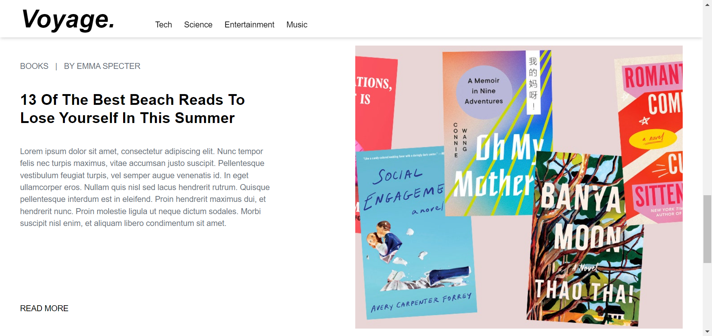

# Voyage Blog Web Application

Welcome to Voyage, a simple and minimalistic blog web application powered by Hygraph CMS. Voyage combines elegant design with effortless functionality to provide an immersive reading experience. Whether you're a passionate writer, an avid reader, or just looking for a tranquil space to share your thoughts, Voyage is your perfect companion.

## Screenshots
### Screenshot 1
- Explore the Voyage homepage with its elegant design.


### Screenshot 2
- Readers can enjoy an immersive reading experience with a focus on content.





## Features

- **Clean and Beautiful Design:** Voyage boasts a visually pleasing and user-friendly design, ensuring an immersive reading experience on all devices.

- **Reader-Friendly Layout:** Each blog post is presented in a reader-friendly format, optimizing readability and comfort.

- **Non-Responsive Layout:** Please note that the current version of Voyage does not have a fully responsive layout. It's recommended to access the application on a desktop or laptop for the best experience.

## Getting Started

Follow these simple steps to get started with Voyage:

1. **Clone the Repository:** Begin by cloning this repository to your local machine using the following command:

   ```bash
   git clone https://github.com/yourusername/voyage-blog.git
   ```

2. **Navigate to the Project Directory:** Move into the project directory:

   ```bash
   cd voyage-blog
   ```

3. **Install Dependencies:** Install the required dependencies by running:

   ```bash
   npm install
   ```

4. **Configure the Environment:** Create a `.env` file in the root directory and provide the necessary environment variables, such as database credentials, API keys, etc.

5. **Start the Application:** Launch the application by running:

   ```bash
   npm start
   ```

6. **Access Voyage:** Open your web browser and navigate to `http://localhost:3000` to access the Voyage blog application.

## Contributing

 Contributions from the community to enhance Voyage are welcomed. To contribute:

1. Fork the repository.
2. Create a new branch for your feature: `git checkout -b feature-name`.
3. Make your modifications and commit them: `git commit -m "Add feature"`.
4. Push to your forked repository: `git push origin feature-name`.
5. Create a pull request, describing your feature and changes.

## Feedback and Support

Have questions, suggestions, or feedback? Feel free to [open an issue](https://github.com/Raj-770/voyage-blog/issues) or reach out to us at rajkumarpambhar770@gmail.com.


[Visit our website](https://voyage-blog.vercel.app/)
